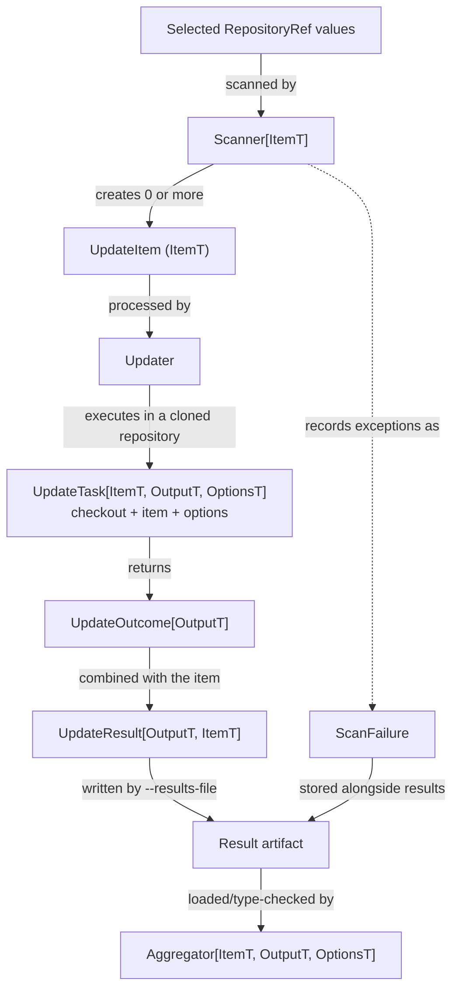

import CodeBlock from '@theme/CodeBlock';
import examplePluginPyproject from '!!raw-loader!../../../examples/plugin/pyproject.toml';
import pythonProjectScanner from '!!raw-loader!../../../examples/plugin/quant_ranger_example_plugin/scanner.py';
import statusSummaryAggregator from '!!raw-loader!../../../examples/plugin/quant_ranger_example_plugin/aggregator.py';
import ensureConfigUpdater from '!!raw-loader!../../../examples/plugin/quant_ranger_example_plugin/updater.py';

# Installable plugins

An installed Python package can add updater and aggregator commands through standard package entry points.
Use this approach when a plugin needs to be shared, versioned, or given typed CLI options.
quant-ranger automatically discovers these entry points from installed packages, with no further configuration.

Use the public modules shown in these examples.
Everything under `quant_ranger._impl` is an implementation detail.
Their classes and signatures are collected in the [Python API reference](../reference/python-api.md).

:::tip[Example]

The repository contains a working [example plugin](https://github.com/quantco/quant-ranger/tree/main/examples/plugin).
Your plugin only needs to include the extension points it provides.

:::

## Package layout

```text
examples/plugin/
├── README.md
├── pixi.toml
├── pyproject.toml
└── quant_ranger_example_plugin/
    ├── aggregator.py
    ├── scanner.py
    ├── site_config.py
    └── updater.py
```

A separately distributed plugin should declare a compatible `quant-ranger` version in its project dependencies.
The in-repository example uses the containing Pixi environment instead.

## Plugin data flow

<div className="plugin-data-flow">



</div>

The scanner defines `ItemT`.
The task may add typed `OutputT` data to its outcome.
Both types are stored in each result and must match the aggregator that reads the artifact.

## Implement an updater

### Scanner

`Scanner[ItemT]` turns each selected repository into zero or more instances of `UpdateItem`.
The example selects projects with a named `[project]` table and passes the project name to the task:

<CodeBlock
  language="python"
  title="quant_ranger_example_plugin/scanner.py"
  showLineNumbers>
{pythonProjectScanner}
</CodeBlock>

Return an empty sequence to skip a repository.
Raised exceptions are recorded as scan failures without stopping work on other repositories.
`RepositoriesScanner` and `RepositoryFileScanner` cover common cases that do not need a custom item type.

### Task and publication

The example updater manages `.example-config` through a pull request and accepts an `--enabled/--disabled` option:

<CodeBlock
  language="python"
  title="quant_ranger_example_plugin/updater.py"
  showLineNumbers>
{ensureConfigUpdater}
</CodeBlock>

`UpdateTask[ItemT, OutputT, OptionsT]` runs inside a temporary checkout.
Implement `run()` and return an `UpdateOutcome`. The example stages `.example-config` and calls `create_pull_request()`.

`create_pull_request()` commits the staged files.
`GitHubClient` enforces `--publish-changes` when its helpers are used.
A `False` return means an existing managed branch was protected from replacement.

For operations without a quant-ranger helper, access the underlying
[PyGithub `Github`](https://pygithub.readthedocs.io/en/stable/github.html)
client directly:

```python
repository = self.context.github_client.github.get_repo(
    self.item.repository_ref.full_name,
)
```

These direct API calls do not enforce `--publish-changes`.
Unexpected exceptions become `failure` results.
Return `UpdateOutcome(result=Status.FAILURE, message=..., details=...)` for expected failures.

The following update outcomes are supported and are shown at the end of an updater run:

| Status       | Meaning                                                                   |
| ------------ | ------------------------------------------------------------------------- |
| `UPDATED`    | The updater produced a change. A dry run reports what would be published. |
| `UP_TO_DATE` | The repository already has the desired state.                             |
| `SKIPPED`    | The item was intentionally not changed.                                   |
| `FAILURE`    | The update task failed. Work on other items continues.                    |

### Updater

`Updater[ItemT, OutputT, OptionsT]` connects the scanner, task, and CLI options.
The three generic arguments define the updater's item, output, and option types.
quant-ranger uses them to validate saved artifacts and aggregator compatibility.
Fields on `EnsureConfigOptions` become command-specific Typer options, and `Annotated` metadata supplies their CLI help.
The options type is inferred from `Updater[...]`.

For more specialized updates, replace one or more of the defaults:

| Extension point        | Use it to                                                            |
| ---------------------- | -------------------------------------------------------------------- |
| `Scanner[ItemT]`       | Select repositories and attach data needed by the task               |
| `UpdateItem`           | Describe one unit of work. Subclass it for typed scanner data        |
| `UpdateOptions`        | Define command-specific CLI options                                  |
| `UpdateTask.run()`     | Inspect or modify the checkout and return an outcome                 |
| `UpdateOutput`         | Store updater-specific structured data in result artifacts           |
| `Updater.make_task()`  | Customize task construction while keeping the standard orchestration |
| `Updater.update_all()` | Replace the standard clone-and-run flow for batching or shared setup |

The default `update_all()` implementation clones every item into a fresh checkout and runs its task, optionally concurrently.
Override it to batch or filter items, perform updater-wide setup, or avoid automatic cloning.
Call `super().update_all(...)` when setup should wrap the standard flow.

### Runtime services

`RunContext` provides:

- `github_client` for repository discovery, file reads, and managed pull requests.
- `site_config` for deployment-wide defaults.
- `logger` for structured console output.

`UpdateTask` additionally exposes `checkout`, `item`, and parsed `options`.
`Logger` provides `debug`, `info`, `warning`, `error`, `exception`, and
`info_panel`. CLI debug messages are enabled with `--debug`.

:::tip[Prefer the public helpers]

Use `context.github_client` for managed pull requests and `RepositoryCheckout` for local Git operations.
Use `context.github_client.github` only when no helper covers the required GitHub operation.

:::

## Implement an aggregator

An aggregator consumes a result artifact after the updater run.
The example counts every result status, reports scan failures, and accepts a `--summary-label` option:

<CodeBlock
  language="python"
  title="quant_ranger_example_plugin/aggregator.py"
  showLineNumbers>
{statusSummaryAggregator}
</CodeBlock>

An aggregator receives the producing updater's name along with its parsed results and scan failures.
It accepts artifacts only when its item and output types are base classes of the producing updater's types.
The example aggregator therefore accepts results from `EnsureConfigUpdater` because `PythonProjectItem` is a subclass of `UpdateItem`, and both use `UpdateOutput`.

An aggregator can instead declare `PythonProjectItem` or a custom `UpdateOutput` subclass to access updater-specific fields.
This makes it compatible with fewer updaters.
Aggregators can also define typed CLI options with `AggregatorOptions` in the same way as updater options.

## Register the commands

Entry points make the classes discoverable without changes to quant-ranger:

<CodeBlock
  language="toml"
  title="examples/plugin/pyproject.toml"
  metastring="{14-15,17-18}"
  showLineNumbers>
{examplePluginPyproject}
</CodeBlock>

The entry-point keys identify package metadata.
The class `name` attributes become the CLI command names.
Names must not collide with a built-in or another plugin command.
Invalid or conflicting updater and aggregator entry points are skipped with a warning so other commands remain available.

The example package also registers an optional [`quant_ranger.site_config` provider](https://github.com/quantco/quant-ranger/blob/main/examples/plugin/quant_ranger_example_plugin/site_config.py).
It changes site-wide defaults; see [Site configuration](site-configuration.md#define-a-site-config) for its contract.
Only one site-config provider may be installed.

## Install and verify

`examples/plugin` in a quant-ranger checkout is a self-contained Pixi workspace with a dependency on quant-ranger, so you can run the CLI from there directly:

```bash
cd examples/plugin
```

Check the help texts to get an overview of installed plugins:

```bash
pixi run quant-ranger update --help
pixi run quant-ranger update ensure-config --help
pixi run quant-ranger aggregate --help
pixi run quant-ranger aggregate status-summary --help
```

Then run the updater and aggregator end to end by replacing `octo-org/octo-repo` with some repository you have access to:

```bash
pixi run quant-ranger update \
  --gh \
  --repository octo-org/octo-repo \
  --results-file results.json \
  ensure-config \
  --enabled

pixi run quant-ranger aggregate status-summary \
  --summary-label "nightly status" \
  results.json
```
